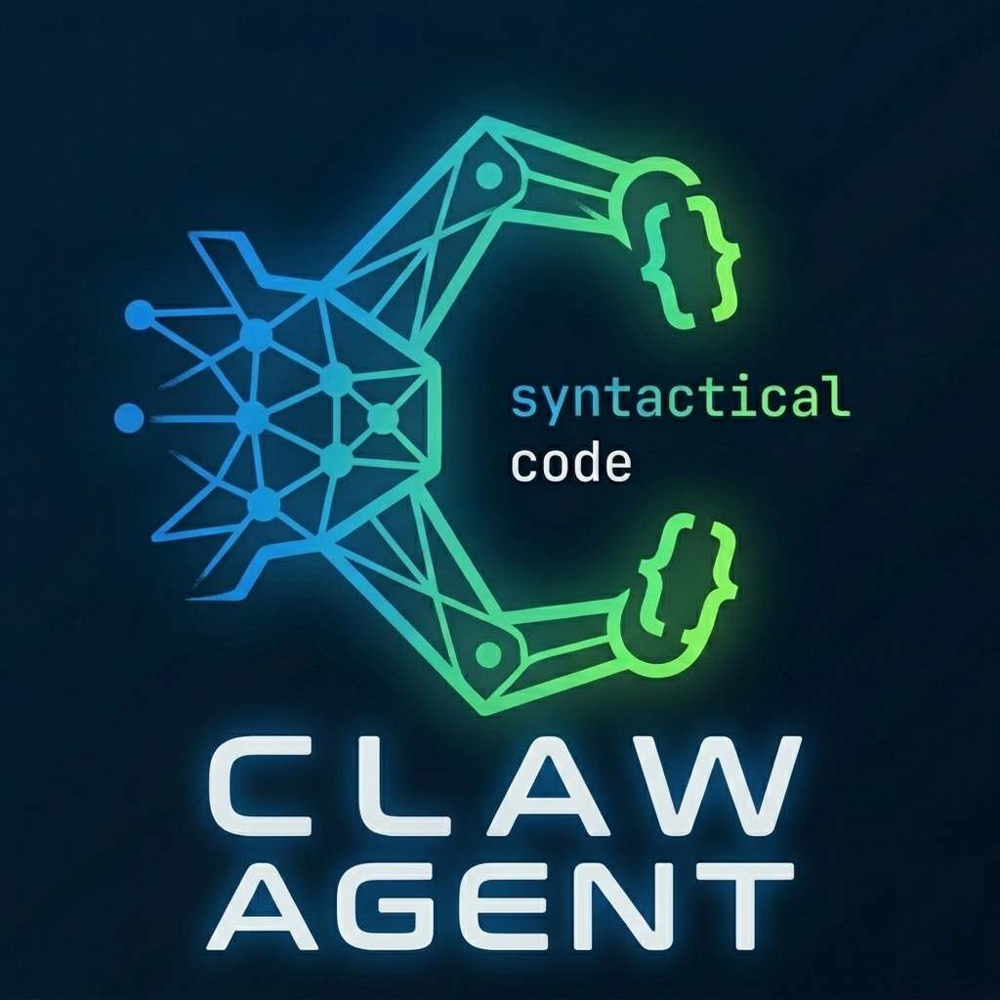

<div align="center">
  

  # 🤖 CLAW AGENT

  **Seu Assistente de IA para Código no VS Code**

  [](https://github.com/RafaelBatistaDev/CLAW-AGENT---Seu-Assistente-de-IA-para-Codigo-VsCode/releases)
  [](LICENSE)
  [](https://code.visualstudio.com/)
  [](https://www.typescriptlang.org/)

  []()
  []()
  []()

  [](#-provedores-de-ia)
  [](#-provedores-de-ia)

  <br/>
  <strong>✨ Analise, refatore, documente e teste código com IA — sem sair do VS Code.</strong>
</div>

---

## 📋 Índice

- [Recursos](#-recursos)
- [Início Rápido (2 minutos)](#-início-rápido-2-minutos)
- [6 Comandos Principais](#-6-comandos-principais)
- [Provedores de IA](#-provedores-de-ia)
- [Compatibilidade](#-compatibilidade-cross-platform)
- [Views no Sidebar](#-views-no-sidebar)
- [Configuração](#-configuração)
- [Compilação e Build](#-compilação-e-build)
- [Troubleshooting](#-troubleshooting)
- [Privacidade](#-privacidade-e-segurança)
- [Contribuir](#-contribuir)
- [Licença](#-licença)

---

## 🎯 Recursos

| Funcionalidade | Descrição |
|---|---|
| 🔍 **Analisar Código** | Detecta bugs, vulnerabilidades e code smells |
| ✨ **Melhorar Código** | Refatoração automática com boas práticas |
| 📚 **Gerar Documentação** | Documentação Markdown profissional |
| 🧪 **Criar Testes** | Testes unitários com mocks |
| ❓ **Fazer Pergunta** | Tire dúvidas sobre qualquer código |
| 🤖 **5 Provedores IA** | OpenAI, Gemini, Claude, Ollama, LocalAI |
| 🖥️ **Cross-Platform** | Windows, macOS, Linux — idêntico em todos |
| 🌙 **Tema Adaptativo** | Dark/Light mode automático |
| 🔐 **Segurança** | APIs sanitizadas, sem vazamento de chaves |

---

## 🚀 Início Rápido (2 minutos)

### 1️⃣ Instalar

```bash
# Opção A: Via VSIX
code --install-extension claw-agent-1.2.0.vsix

# Opção B: VS Code → Extensions → ⋮ → Install from VSIX
```

### 2️⃣ Configurar Provedor de IA

Escolha **uma** das opções e configure a variável de ambiente:

```bash
# OpenAI (chatGPT) — Recomendado
export OPENAI_API_KEY="sk-..."

# Google Gemini — Grátis
export GOOGLE_API_KEY="AIzaSy..."

# Anthropic Claude — Premium
export ANTHROPIC_API_KEY="sk-ant-..."

# Ollama — Local, 100% grátis
export OLLAMA_ENDPOINT="http://localhost:11434"

# LocalAI — Local, 100% grátis
export LOCALAI_ENDPOINT="http://localhost:8080"
```

> 💡 **Dica:** Adicione ao `~/.bashrc` (ou `~/.zshrc`) para persistir entre sessões.

### 3️⃣ Usar

Abra qualquer arquivo de código → clique com botão direito → escolha um comando CLAW Agent.

---

## 📊 6 Comandos Principais

| Comando | Atalho | O que faz |
|---|---|---|
| 🔍 **Analisar** | Clique direito → Analisar | Bugs, segurança, performance, code smells |
| ✨ **Melhorar** | Clique direito → Melhorar | Refatora, otimiza, aplica boas práticas |
| 📚 **Documentar** | Clique direito → Documentar | Gera documentação Markdown completa |
| 🧪 **Testar** | Clique direito → Testar | Cria testes unitários com mocks |
| ❓ **Perguntar** | Clique direito → Perguntar | Responde dúvidas sobre o código |
| ℹ️ **Status** | `Ctrl+Shift+P` → Status | Informações do agente e ajuda |

> Todos os comandos também estão disponíveis em: `Ctrl+Shift+P` → digite "CLAW Agent"

---

## 🤖 Provedores de IA

| Provider | Chave | Custo | Qualidade | Velocidade | Ideal para |
|---|---|---|---|---|---|
| 🟠 **OpenAI** | `OPENAI_API_KEY` | 💰 Pago | ⭐⭐⭐⭐⭐ | ⚡ Rápido | Uso geral |
| 🔵 **Gemini** | `GOOGLE_API_KEY` | ✅ Grátis* | ⭐⭐⭐⭐ | ⚡ Rápido | Economia |
| 🔴 **Claude** | `ANTHROPIC_API_KEY` | 💰 Pago | ⭐⭐⭐⭐⭐ | ⚡ Rápido | Código complexo |
| 🏠 **Ollama** | — | ✅ Grátis | ⭐⭐⭐ | ⚠️ Médio** | Offline/privacidade |
| 🏠 **LocalAI** | — | ✅ Grátis | ⭐⭐ | ⚠️ Lento** | Backup offline |

*\* Plano gratuito com limite de requisições diárias*  
*\*\* Performance depende do hardware local*

### Obtendo Chaves de API

| Provider | Link |
|---|---|
| OpenAI | [platform.openai.com/api-keys](https://platform.openai.com/api-keys) |
| Google Gemini | [aistudio.google.com](https://aistudio.google.com/apikey) |
| Anthropic Claude | [console.anthropic.com/keys](https://console.anthropic.com/keys) |
| Ollama | [ollama.ai](https://ollama.ai) — instalar e pronto |
| LocalAI | [github.com/mudler/LocalAI](https://github.com/mudler/LocalAI) |

---

## 🖥️ Compatibilidade Cross-Platform

| Sistema | Node | Arquitetura | Status |
|---|---|---|---|
| 🪟 Windows 10/11/Server | 18+ | x64, x86, ARM64 | ✅ |
| 🍎 macOS Intel / Apple Silicon | 18+ | x64, arm64 | ✅ |
| 🐧 Linux (Ubuntu, Fedora, Debian) | 18+ | x64, arm64 | ✅ |

### Destaques da v1.2.0

- ✅ Configuração via interface do VS Code (Settings UI)
- ✅ Modelos de IA atualizados (GPT-4o, Gemini 2.5 Pro, Claude Sonnet 5)
- ✅ Renderização segura com CSP no painel de resultados
- ✅ Comandos de menu mais robustos (mapeamento por label completo)
- ✅ Integração com `clawagent.*` settings do VS Code

---

## 🌳 Views no Sidebar

### 📊 Configurações (no Explorer)

Acesse: clique em **CLAW Agent - Configurações** no Explorer

```
📊 STATUS E INFORMAÇÕES   ⚡ COMANDOS RÁPIDOS   ⚙️ CONFIGURAÇÕES
├─ Status: 🟢 Ativo       ├─ 🔍 Analisar        ├─ Provedor de IA
├─ Provedor: OpenAI       ├─ ✨ Melhorar        ├─ Timeout
├─ Versão: 1.2.0          ├─ 📚 Documentar      ├─ Idioma
└─ Arquivo Atual          ├─ 🧪 Testar          ├─ Profundidade
                           ├─ ❓ Perguntar       └─ ⚙️ Todas
                           └─ 📋 Status
```

### 📂 Sugestões do CLAW (Activity Bar)

Clique no ícone 🤖 na Activity Bar para sugestões contextuais baseadas no arquivo aberto.

---

## ⚙️ Configuração

### Via VS Code Settings UI

1. `Ctrl+Shift+P` → "CLAW Agent: Abrir Configurações"
2. Ou: `Ctrl+,` → Pesquise por "clawagent"

### Propriedades disponíveis

| Seção | Propriedade | Descrição |
|---|---|---|
| Gerais | `clawagent.enabled` | Ativar/desativar global |
| Gerais | `clawagent.language` | Idioma (pt-br, en-us, etc.) |
| Provedor | `clawagent.aiProvider` | auto, openai, gemini, claude, ollama, localai |
| OpenAI | `clawagent.openai.apiKey` | Chave de API OpenAI |
| Gemini | `clawagent.gemini.apiKey` | Chave de API Google Gemini |
| Claude | `clawagent.claude.apiKey` | Chave de API Anthropic Claude |
| Comportamento | `clawagent.requestTimeout` | Timeout em ms (padrão: 30000) |
| Comportamento | `clawagent.maxRetries` | Máx. tentativas (padrão: 3) |
| Análise | `clawagent.analyze.depth` | quick, balanced, deep |

---

## 📦 Compilação e Build

### Pré-requisitos

```bash
node >= 18
npm >= 9
```

### Compilar

```bash
# Instalar dependências
npm install

# Compilar TypeScript
npm run compile

# Modo watch (desenvolvimento)
npm run watch

# Build de produção (TypeScript + Webpack)
npm run compile:prod

# Empacotar VSIX
npm run package

# Verificar o que vai no pacote
npm run package:dry
```

### Build em Container

O projeto suporta 3 métodos de build em container:

- **Distrobox** (Ubuntu): `./build-distrobox.sh`
- **Podman** (Alpine, mais leve): `./build-podman.sh`
- **Docker Compose** (padrão indústria): `docker-compose up --build`

---

## 🐛 Troubleshooting

| Problema | Causa provável | Solução |
|---|---|---|
| "Nenhuma IA configurada" | Chave de API ausente | Configure `OPENAI_API_KEY` ou use Configurações |
| "Timeout" | Conexão lenta ou servidor ocupado | Aumente `clawagent.requestTimeout` |
| "API Key inválida" | Chave expirada ou incorreta | Gere nova chave no console do provider |
| "Erro 429" | Rate limit atingido | Aguarde e tente novamente |
| Extensão não carrega | Erro de compilação | Veja `Help → Toggle Developer Tools` |

---

## 🔐 Privacidade e Segurança

- ✅ Nenhuma chave de API armazenada no repositório
- ✅ Secrets via variáveis de ambiente ou VS Code Secrets
- ✅ Suporte 100% offline (Ollama, LocalAI)
- ✅ Código sanitizado — sem vazamento de chaves em logs
- ✅ Content-Security-Policy no painel webview (previne XSS)
- ✅ MIT License — uso comercial permitido

---

## 🤝 Contribuir

Contribuições são bem-vindas! Siga estes passos:

1. Faça um fork do repositório
2. Crie uma branch: `git checkout -b feature/sua-feature`
3. Commit: `git commit -m 'feat: adiciona nova funcionalidade'`
4. Push: `git push origin feature/sua-feature`
5. Abra um Pull Request

**Reportar bugs:** [Abrir issue](https://github.com/RafaelBatistaDev/CLAW-AGENT---Seu-Assistente-de-IA-para-Codigo-VsCode/issues)

---

## 📄 Licença

**MIT** © 2026 Rafael Batista

Você é livre para usar, modificar e distribuir esta extensão para qualquer fim, incluindo comercial.

---

<div align="center">
  <strong>Feito com ❤️ para devs que amam código limpo</strong>
  <br/><br/>
  <a href="https://github.com/RafaelBatistaDev">🐙 GitHub</a>
  &nbsp;|&nbsp;
  <a href="mailto:rafaelbatistadev@outlook.com.br">📧 Email</a>
  &nbsp;|&nbsp;
  <a href="https://github.com/RafaelBatistaDev/CLAW-AGENT---Seu-Assistente-de-IA-para-Codigo-VsCode/issues">🐛 Issues</a>
  <br/><br/>
  <sub>v1.2.0 • Cross-Platform ✅ • Production Ready ✅ • MIT License ✅</sub>
</div>
